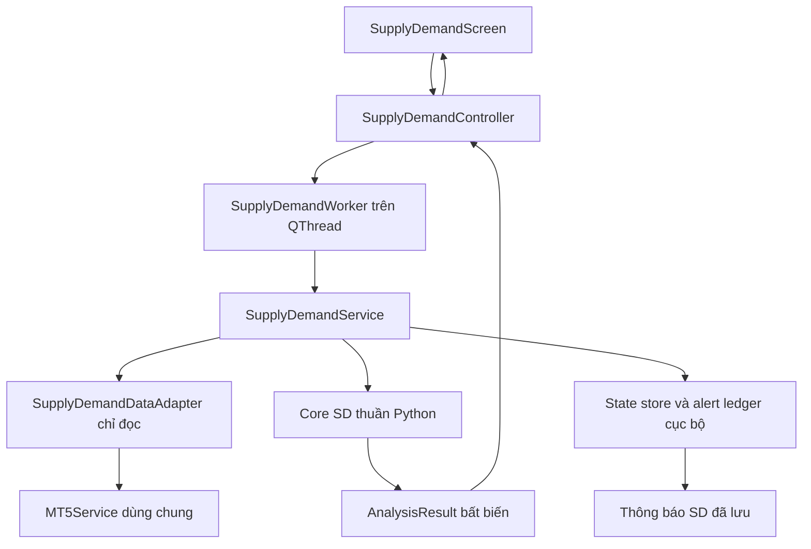

# SD Technical Design

> Chủ trì thiết kế: Tech Lead. Ngày soạn: 08/09/2026.
> Trạng thái: `DRAFT` — thiết kế đích, chưa triển khai và chưa nối runtime.
> Nguồn nghiệp vụ: `01-scope-and-requirements.md` và `02-trading-rules.md`
> (`sd-rules-v1`, đang `DRAFT`), thuộc quyền quản lý của PO.
> Cập nhật 08/09/2026: câu trả lời PO cho TL-PO-01 đến TL-PO-09 được ghi tại
> mục 14 theo yêu cầu chủ ứng dụng; phạm vi là phần mềm cá nhân.

## 1. Mục tiêu, thẩm quyền và mức độ hoàn thiện

Tài liệu mô tả cách triển khai SD trong ứng dụng desktop hiện có: module,
contract, nguồn dữ liệu, xử lý nền, lưu trữ, cảnh báo và các điểm tích hợp.
Phạm vi vẫn là phân tích/cảnh báo cá nhân, mọi truy cập MT5 từ SD chỉ đọc.

Tech Lead quyết định cách tổ chức code và xử lý kỹ thuật trong phạm vi PO đã
xác định. Không sửa, bổ sung hoặc diễn giải lại quy tắc trong
[01](01-scope-and-requirements.md) và [02](02-trading-rules.md) khi chưa được PO
cho phép. Các vấn đề nghiệp vụ phát hiện khi thiết kế được ghi tại mục 14;
ghi vấn đề không đồng nghĩa quyết định thay PO.

Mục 14 lưu nguyên văn câu trả lời PO. Đã đồng bộ TL-PO-01–09 vào `01`/`02`
và contract/pipeline/storage/UI ở tài liệu này theo yêu cầu chủ ứng dụng.
Không còn dùng baseline cũ để quyết định ID, vòng đời D1, kế hoạch hoặc
restore. Giữ DRAFT; TL-PO-02 có nguyên tắc đã chốt nhưng vẫn cần xác minh
lịch biên broker thực tế khi triển khai, không phải câu hỏi PO chưa trả lời.

Phân biệt ba loại nội dung:

| Loại | Ý nghĩa |
|---|---|
| Hiện trạng đã kiểm tra | Có trong code tại thời điểm đọc; chỉ là điểm tích hợp, không chứng minh SD đã tồn tại. |
| Thiết kế kỹ thuật đề xuất | Quyết định triển khai của tài liệu này, cần review kỹ thuật và kiểm thử khi viết code. |
| Quyết định PO đã đồng bộ | Mục 14 là bản ghi; `01`/`02` là nguồn chuẩn đã cập nhật. Bằng chứng broker/test/code vẫn cần có khi triển khai. |

Có thể triển khai/test các thành phần độc lập đã đủ contract bằng fixture.
Không bật runtime với rules `DRAFT`, và không coi việc hoàn thiện hạ tầng là
hoàn thành định hướng vùng D1. `04` và `05` hiện còn trống; tài liệu này đưa ra
đầu vào kỹ thuật cho hai tài liệu đó, không thay thế thiết kế UX/nghiệm thu.

## 2. Hiện trạng ứng dụng và quyết định tích hợp

Các đường dẫn dưới đây là code hiện có đã đối chiếu:

| Điểm hiện có | Nhận xét | Quyết định cho SD |
|---|---|---|
| [AppController](../../controllers/app_controller.py) | DI container, lazy singleton cho MT5/service/controller; có `shutdown()`. | Sở hữu controller/service SD ở application scope; dừng SD trước khi disconnect MT5. |
| [MT5Service](../../services/mt5_service.py) | Có `_operation_lock` dạng `RLock` và decorator tuần tự hóa trên nhiều phương thức đọc/ghi. | Dùng cùng instance từ AppController; adapter SD không tạo kết nối MT5 thứ hai và không sở hữu shutdown. |
| `MT5Service.load_ohlcv()` | Đọc từ bar index 0, có thể bao gồm nến đang mở; mặc định gọi `symbol_select`. | Không dùng trực tiếp làm contract nến đóng/chỉ đọc của SD. Bổ sung đường đọc trung tính có metadata về bar và không đổi Market Watch. |
| `MT5Service.symbol_tick()` | Trả Bid/Ask cùng `time`, `time_msc` trong DTO của Order Management. | Không đưa DTO này vào core SD; đường đọc trung tính trả quote thô, adapter chuyển sang SDQuote. |
| `MT5Service.execution_snapshot()` | Trả model Scanner; đọc thêm dữ liệu phục vụ thực thi. | Không dùng để lấy metadata hoặc quyết định data safety cho SD. |
| [CandleHistoryCache](../../services/candle_history_cache.py) | Cache nến có định danh nguồn, kiểm tra tail/gap và callback gap allowance. | V1 dùng cache SD riêng để kiểm soát session và revision; không kế thừa kết luận an toàn của cache Scanner. |
| [Candle](../../core/market_models.py) | Dataclass dùng `time` và OHLC float, không có close time/closed flag. | Chuyển đổi tại adapter; không mặc nhiên coi `time` là close time hoặc datetime naive là UTC. |
| [ScannerWorker](../../workers/scanner_worker.py) | Mẫu `QObject` có signal, chạy task nền. | Áp dụng cơ chế Qt tương tự trong worker riêng, không kế thừa task/aftercare Scanner. |
| [MainWindow](../../ui/main_window.py), [navigation](../../ui/navigation.py) | Đăng ký route, screen factory và nav icon. | Thêm route `supply_demand` với screen riêng khi được tích hợp runtime. |
| [AnalysisChartView](../../ui/components/chart_view.py), [chart bridge](../../ui/chart_bridge.py) | QWebEngineView và payload/chart script hiện có. | Tạo chart adapter/view SD riêng; chỉ tái sử dụng theme và hạ tầng trình bày trung tính. |
| [config.paths](../../config/paths.py) | Runtime data nằm ở `app_data_dir()`, không phải thư mục source. | Dữ liệu SD nằm dưới `app_data_dir()/supply_demand/`. |
| [SettingsService](../../services/settings_service.py) | Load/save các nhóm AppSettings được khai báo tường minh. | Lưu settings SD qua service riêng; không chèn khóa lạ vào settings chung rồi kỳ vọng được giữ khi save. |

`MT5Service` hiện còn import model và instrumentation Scanner. Việc dùng
instance này là ngoại lệ hạ tầng theo README SD, không phải quyền sử dụng
nghiệp vụ Scanner. Core/service SD không import các engine đó; kiểm thử adapter
phải chứng minh đường đọc được dùng không gọi scoring, risk hoặc thực thi.

Khóa hiện tại có phạm vi một instance, không bảo vệ mọi instance/process MT5.
SD phải dùng instance chung. Khi tích hợp cần review các caller kết nối/ngắt
kết nối hiện có; không coi khóa này là bảo đảm tuyệt đối cho SDK toàn ứng dụng.

## 3. Phân lớp và module đích



Không tạo cây feature-first `supply_demand/core/...`. File mới nằm trực tiếp
trong các lớp hiện có và mang tiền tố `supply_demand_`:

| File đích | Trách nhiệm |
|---|---|
| `core/supply_demand_models.py` | Dataclass, enum, model bất biến và contract đầu vào/đầu ra. |
| `core/supply_demand_parameters.py` | Kiểu tham số, validation và rules descriptor; ánh xạ registry `02`, mục 17. |
| `core/supply_demand_reason_codes.py` | Enum đóng đúng registry `02`, mục 18.3 và thứ tự sắp lý do. |
| `core/supply_demand_identity.py` | Canonical JSON, chuyển giá sang tick và ID đúng `02`, mục 18.2. |
| `core/supply_demand_indicators.py` | ATR Wilder cửa sổ hữu hạn, epsilon và swing có thời điểm xác nhận. |
| `core/supply_demand_zone_detector.py` | Arrival/base/departure, biên và khử trùng; không đọc MT5. |
| `core/supply_demand_lifecycle.py` | Reducer zone/retest, TESTED chỉ D1, broken/expired theo sự kiện và thời gian đã cho. |
| `core/supply_demand_context.py` | D1 bias/location, lifecycle context D1, liên kết D1–H4/H1–H4 và cản D1. |
| `core/supply_demand_trade_plan.py` | Entry zone, protective zone, cản H4/D1, rounding SL/TP và preliminary R:R. |
| `core/supply_demand_quality.py` | Năm thành phần điểm và grade; không tạo thêm điểm D1. |
| `core/supply_demand_confirmation.py` | Touch và cửa sổ xác nhận M15, rejection/engulfing/micro BOS. |
| `core/supply_demand_setup_state.py` | Conflict, chọn setup, công thức READY, ưu tiên trạng thái và transition. |
| `core/supply_demand_analysis.py` | Điều phối pipeline thuần, trả kết quả mới mà không sửa input. |
| `services/supply_demand_data_adapter.py` | Port dữ liệu, mapping broker, chuẩn hóa nguồn và cache nến SD. |
| `services/supply_demand_session_service.py` | Tạo lịch biên nến kỳ vọng từ policy và thông tin biên của nguồn. |
| `services/supply_demand_settings_service.py` | Load/validate/save cấu hình độc lập; cấp config revision. |
| `services/supply_demand_state_store.py` | SQLite schema, transaction, entity refs/evidence/revision inputs và khôi phục. |
| `services/supply_demand_alert_service.py` | Ghi sự kiện READY duy nhất, cung cấp inbox, không gọi order API. |
| `services/supply_demand_service.py` | Fetch, gọi core, commit, restore và báo trạng thái vận hành. |
| `controllers/supply_demand_controller.py` | Sở hữu lịch chạy, worker, generation và tín hiệu cho màn hình. |
| `workers/supply_demand_worker.py` | Thực thi công việc nền, cancellation và lifecycle Qt. |
| `ui/screens/supply_demand_screen.py` | Màn hình SD và xử lý ý định người dùng. |
| `ui/supply_demand_presentation.py` | Chuyển result thành row/detail/chart payload, dịch reason codes. |
| `ui/components/supply_demand_chart_view.py` | View vùng và kế hoạch SD, không tính nghiệp vụ. |
| `config/supply_demand_defaults.json` | Default theo namespace `sd`, phiên mặc định và mapping tường minh. |
| `tests/test_supply_demand_*.py` | Unit/contract/integration tests tương ứng các lớp. |

Nếu chart cần HTML/JS mới, đặt asset `supply_demand_*` trong thư mục asset
chart hiện có; không đưa nội dung SMC hoặc lệnh vào payload SD. Số module có
thể được gộp khi code nếu vẫn giữ ranh giới trách nhiệm và khả năng test.

Dependency một chiều: core chỉ dùng Python chuẩn; service dùng core và port
hạ tầng; worker gọi service; controller điều phối; UI chỉ nhận result/intent.
`core/supply_demand_*` không import PyQt, MT5 SDK, service, UI, AI hoặc engine
giao dịch cũ. Clock và dữ liệu thị trường luôn truyền vào, không đọc global.

## 4. Contract và quy ước dữ liệu

### 4.1 Kiểu cơ sở

- Dùng `@dataclass(frozen=True, slots=True)` và tuple cho result chuyển giữa
  các lớp/thread; không phát mutable dict đang tiếp tục được worker cập nhật.
- `SDTimeframe`: `D1 | H4 | H1 | M15`; `SDSide`: `DEMAND | SUPPLY`;
  hướng setup `BUY | SELL`; `SDEntryMode`: `TOUCH | M15_CONFIRMATION`.
- Zone/setup/retest/alert giữ nguyên tên trường bắt buộc trong `02`, mục 18.1.
  Các trường bổ sung dưới đây là metadata kỹ thuật, không thay canonical ID.
- Giá và chỉ số tính bằng `Decimal`, nhận float nguồn qua `Decimal(str(value))`;
  từ chối NaN/Infinity. Tính trong local decimal context cố định, precision 34,
  rounding `ROUND_HALF_EVEN`; các phép làm tròn biên/ID dùng đúng hướng riêng
  của `02`, không dùng rounding mặc định này để thay quy tắc nghiệp vụ.
- Không ép OHLC lên lưới tick trước detector. Giá vùng chỉ làm tròn tại bước
  được `02` quy định. Entry sub-zone làm tròn vào trong, SL ra ngoài và TP
  bảo thủ đúng chiều BUY/SELL theo TL-PO-05; tính R:R/grade sau rounding.
- Trong JSON lưu Decimal bằng chuỗi thập phân, thời gian bằng UTC ISO có `Z`;
  chỉ payload chart dùng số hữu hạn phục vụ hiển thị. Không đọc số đã format
  trên UI trở lại core để tính điểm hoặc ID.
- Thời gian nghiệp vụ dùng datetime aware UTC; candle/ID giây nguyên nhưng
  quote/touch giữ time_msc và precision nguồn. Có time/time_msc phải kiểm tra
  nhất quán; không truncate hoặc bịa mili giây. MT5 API đã UTC, không dịch
  thêm broker offset. Nguồn naive chỉ chuyển khi convention rõ; UI mới đổi
  timezone hiển thị. Giữ received-at tách biệt source time.

### 4.2 Model đầu vào

| Model | Trường chính / invariant |
|---|---|
| `SDSourceScope` | `provider`, `broker`, `server`, định danh tài khoản băm, `connection_generation`; chỉ để phân vùng dữ liệu và phát hiện đổi nguồn. |
| `SDSymbolSpec` | `canonical_symbol`, `broker_symbol`, `asset_class`, `tick_size`, `price_basis`, `session_policy_id`, `mapping_revision`. |
| `SDCandle` | `time` là open, `close_time` theo lịch biên broker có provenance/effective range/revision, OHLC; `[open, close)`, chỉ nến đóng và timestamp giây nguyên vào core. |
| `SDQuote` | `bid`, `ask`, `source_time`, `source_precision`, `time_msc`/`time` gốc nếu có, `received_at`; mili giây round-trip, source time không thay bằng clock máy. |
| `SDCandleSeries` | Symbol/timeframe, tuple nến tăng dần, `series_revision`, `last_closed_at`, mốc biên nguồn và trạng thái lấy dữ liệu. |
| `SDSessionPolicy` | ID, IANA timezone, các khoảng mở tuần và nghỉ ngày, provenance profile/override; biểu diễn khoảng nửa mở `[start, end)`. |
| `SDMarketSnapshot` | Scope, symbol spec, đủ bốn series, quote hoặc lý do thiếu, `as_of`, `fetched_at`, `data_revision`, `config_revision`, safety report. |
| `SDAnalysisRequest` | `request_id`, generation, symbols, config/rules descriptor, yêu cầu full/poll; không có risk percent, volume hoặc auto-trade flag. |

`as_of` được chốt cho từng snapshot symbol khi hoàn tất batch đọc, trước khi
gọi core, rồi giữ cố định trong toàn bộ lần phân tích đó. Không lấy thời điểm
enqueue request làm cutoff khiến quote vừa đọc sau đó bị loại hàng loạt.
Không để lần đọc bổ sung đưa nến/tick có timestamp sau `as_of` vào cùng kết
quả; cần dữ liệu mới thì tạo snapshot/revision mới. Từng series có watermark
riêng vì nguồn không được lấy nguyên tử trên tất cả symbol/timeframe. Kiểm
tra an toàn từng series, không gán timestamp mới cho dữ liệu cũ để làm nó có
vẻ mới.

### 4.3 Model nghiệp vụ và kết quả

| Model | Nội dung |
|---|---|
| `SDZone` | Toàn bộ trường Zone trong `02`; bổ sung base/departure index theo time, normalized low/high, điểm Departure/Base và bằng chứng phát hiện. State chỉ tồn tại trong kết quả RAM/tái dựng. |
| `SDRetest` | Toàn bộ contract Retest; `ended_at` nullable, nguồn start và ID ordinal được kiểm tra nhất quán. |
| `SDTradePlan` | Giá sau rounding, R:R chưa format, `opposing_zone_id/timeframe`, `entry_inside_opposing_zone`, entry low/high, source/protective/H4 parent IDs; thiếu giá là None. |
| `SDQualityBreakdown` | `departure`, `base`, `freshness`, `location`, `target_space`, tổng và grade; tối đa 30/20/20/15/15 đúng `02`. |
| `SDSetup` | Contract `02`; hướng/breakdown, first retest, `entry_touch_latched`, first-touch evidence/M15 candle ref, mode hiện tại và confirmation evidence. Mode không thuộc ID; thiếu plan giá None và không READY. |
| `SDD1StructureContext` | Bias, confirmed swing IDs/time, dealing range/location hoặc UNKNOWN; không giả lập vùng D1 bằng dealing range. |
| `SDD1ZoneContext` | Status COMPLETE/PENDING, vùng D1 cùng formation score 0–50/state/retest, aligned D1 ID, nearest D1 obstacle ID/distance từ Entry, nhãn near và reason codes; không grade D1. |
| `SDReplayEvidence` | Event ID/sequence/type, scope/entity refs, time/precision/Bid/Ask, source và M15 candle refs, config/session/data revisions, đầu vào cần tái tính mode. Grade/mode lưu kèm chỉ đối chiếu. |
| `SDTransition` | Setup ID, trạng thái trước/sau, thời điểm, retest ID, reason codes và revision gây chuyển trạng thái. |
| `SDAnalysisResult` | Request/generation, scope, symbol, revisions, as-of/watermarks, vùng/retest/setup, D1 context, transitions, diagnostic và thời gian xử lý. |

Để lý do xác định, core dùng đúng enum trong `02`, sắp theo nhóm rồi tên.
Thông báo kỹ thuật như database hỏng, request bị hủy hoặc đặc tả chưa hoàn
thiện thuộc `SDOperationalIssue` ở service, không thêm chuỗi tự do vào enum
reason nghiệp vụ. Operational status không phải setup state.

Các operational status đề xuất: `IDLE`, `LOADING`, `RESTORING`, `ACTIVE`,
`SESSION_CLOSED`, `DEGRADED`, `STOPPING`, `ERROR`, `SPEC_PENDING`. `ACTIVE`
chỉ mô tả bộ phân tích đang vận hành, không có nghĩa có setup READY.

### 4.4 API giữa các lớp

Chữ ký định hướng cho triển khai; mỗi method phải trả DTO hoặc lỗi typed:

```python
class SDMarketDataPort(Protocol):
    def read_snapshot(self, symbol, history_request, scope) -> SDMarketSnapshot: ...

def analyze_full(snapshot, parameters, restore_evidence) -> SDAnalysisResult: ...
def analyze_update(previous, snapshot, parameters) -> SDAnalysisResult: ...

class SupplyDemandService:
    def restore_and_analyze(self, request, cancellation) -> SDBatchResult: ...
    def poll(self, request, cancellation) -> SDBatchResult: ...
    def shutdown(self) -> SDStoreResult: ...

class SupplyDemandStateStore:
    def load_restore_bundle(self, scope, rules_version) -> SDRestoreBundle: ...
    def commit_cycle(self, revision, snapshot_refs, evidence, revision_inputs, alerts) -> SDCommitResult: ...
    def read_alerts(self, scope, cursor, limit) -> SDAlertPage: ...
```

Service là chủ sở hữu state RAM; core trả bản mới. Chỉ commit result có đủ
scope/config/generation hợp lệ. `SDBatchResult` có kết quả hoặc lỗi riêng cho
mỗi symbol; lỗi một symbol không được làm kết quả cũ của nó trông như mới.

## 5. Mapping symbol, asset class và session policy

### 5.1 Registry và thứ tự ưu tiên

Mapping bắt buộc:

```text
canonical_symbol -> broker_symbol cụ thể
canonical_symbol -> asset_class -> default SDSessionPolicy
                                   + symbol override
```

Defaults đặt trong `config/supply_demand_defaults.json`, cấu hình cá nhân đặt
ở `app_data_dir()/supply_demand/settings.json`, tất cả dưới khóa `sd`.

| Thông tin | Thứ tự áp dụng từ cao xuống thấp |
|---|---|
| Broker symbol | Mapping cá nhân tường minh -> danh sách alias có thứ tự cho canonical symbol trong cấu hình SD. Chỉ chọn alias hiện có/visible; không tự đổi Market Watch. |
| Asset class | Giá trị cá nhân tường minh, hợp lệ -> registry SD mặc định cho canonical symbol. Không suy đoán từ hậu tố broker, contract size hoặc kết quả Scanner. |
| Session policy | Override đầy đủ theo symbol -> override profile theo asset class -> profile SD mặc định của asset class. |
| Tham số rules | Override namespace `sd.parameters` -> default registry của rules version; luôn validate đầy đủ trước khi áp dụng. |

Session override thay thế toàn bộ policy ở mức tương ứng, không merge từng
ngày/nghỉ một cách ngầm định. Các field bắt buộc thiếu làm override không hợp
lệ, không rơi xuống profile khác để che lỗi. Lưu provenance để UI giải thích
policy nào đang được dùng.

Danh mục ứng dụng hiện có 31 mã tại `config/constants.py`: 28 Forex,
`XAU/USD`, `XAG/USD`, `BTC/USD`. Đề xuất seed registry SD tường minh với Forex
cho 28 cặp, METAL cho XAU/XAG và CRYPTO cho BTC. Danh mục này dùng để lựa chọn; watchlist khởi tạo đã chốt là EUR/USD,
GBP/USD, USD/JPY, XAU/USD, cấu hình cá nhân đã lưu được ưu tiên. Không áp
trần cứng 8 mã; tải theo watchlist/khả năng máy. Không gọi `active_symbols()`
vì danh sách rỗng ở hàm đó bật tất cả; trong SD danh sách rỗng không chạy.
Mã không có mapping/session/data hợp lệ hiển thị nguyên nhân, không tự đổi
Market Watch để làm nó hợp lệ.

Resolve không thành công, ambiguous mapping hoặc hai canonical symbol trỏ
cùng broker symbol: trả `DATA_SYMBOL_UNRESOLVED`. Thiếu asset class/session
hợp lệ: `DATA_SESSION_POLICY_MISSING` cùng diagnostic field cụ thể. Không
đoán nhóm tài sản; không phát READY cho symbol lỗi.

### 5.2 Phiên mặc định và biên nến

Profile mặc định đúng `02`, mục 16:

| Nhóm | Timezone | Mở tuần | Nghỉ |
|---|---|---|---|
| FOREX | `America/New_York` | Chủ nhật 17:00 đến thứ Sáu 17:00 | Không nghỉ ngày. |
| METAL | `America/New_York` | Chủ nhật 18:00 đến thứ Sáu 17:00 | Thứ Hai–thứ Năm 17:00–18:00. |
| CRYPTO | `UTC` | 24/7 | Không nghỉ. |

Session service thực thi policy đã chọn, không tự bổ sung lịch nghỉ lễ hoặc
lịch từ economic calendar. Override cá nhân phải khớp broker. Lịch mở phiên
không quyết định cách chia D1/H4 của broker; lưu riêng thông tin biên nến nguồn
và không resample theo New York hay giờ máy.

Dùng `zoneinfo.ZoneInfo`; gói đóng Windows phải có dữ liệu IANA, đề xuất đóng
kèm dependency `tzdata` và kiểm tra được `America/New_York` khi startup.
Windows thường không có sẵn kho IANA mà zoneinfo cần. [Python zoneinfo](https://docs.python.org/3/library/zoneinfo.html)

Service cung cấp `is_open(t)`, `expected_opens(tf, start, end)` và
`expected_closes(tf, start, end)` từ policy + lịch biên nguồn đã xác thực.
Gap/stale/age dùng các biên trong phiên đúng `02`; không chỉ chia số giây lịch
cho duration. Kiểm thử qua DST, cuối tuần, giờ nghỉ kim loại và crypto 24/7.
Close time dùng lịch chia nến broker `[open, close)` riêng với lịch phiên,
không tick cuối, không open kế tiếp qua gap hoặc mặc định open + duration
cho nến cắt phiên/DST. Giữ nến ngắn thật; giờ nghỉ nằm trong kỳ H4/D1 không
tự chia kỳ. Lưu provenance, phạm vi hiệu lực và revision theo scope/symbol/
timeframe. TL-PO-02 đã chốt nguyên tắc, còn xác minh convention broker khi
triển khai; thiếu lịch/close time trả DATA_CANDLE_BOUNDARY_UNRESOLVED và chặn
READY symbol đó. Không yêu cầu sẵn lịch sử test nhiều broker/kỳ DST.

Đổi policy/asset class/mapping: tăng config revision, hủy tác vụ cũ, xóa safety
cache và full analysis lại cả lịch sử đã tải. Không giữ READY của revision cũ.

## 6. Adapter MT5 chỉ đọc và cache

### 6.1 Đường đọc trung tính

Đề xuất thêm API hạ tầng trung tính vào `services/mt5_service.py` để trả một
batch thô gồm scope trước/sau, symbol metadata, quote, rates và thông tin bar
hiện hành. API được bao bằng `_serialized_mt5_operation` và chỉ gọi:

- đọc trạng thái kết nối/account identity;
- `symbols_get`, `symbol_info`, `symbol_info_tick`;
- `copy_rates_from_pos` hoặc `copy_rates_range`.

Không gọi `symbol_select`, không gửi/sửa/đóng/hủy lệnh, không đọc score/decision
Scanner. Kết nối do ứng dụng quản lý; trạng thái cho phép trade không phải điều
kiện để SD được đọc dữ liệu. Adapter không gọi private metadata helper của
Order Management hoặc giữ khóa MT5 khi chạy thuật toán/ghi DB.

Nếu SDK trả account/source identity khác giữa đầu và cuối batch, loại batch,
đổi connection generation và tái dựng scope mới. Không trộn nến/ledger từ hai
broker hoặc tài khoản vào một kết quả.

MetaTrader đánh số bar 0 là bar hiện tại; lịch sử còn phụ thuộc giới hạn nến
trong terminal. Vì vậy không đưa nguyên kết quả từ index 0 vào detector và
không giả định yêu cầu N nến luôn nhận đủ N. [MetaQuotes](https://www.mql5.com/en/docs/python_metatrader5/mt5copyratesfrompos_py)

Adapter yêu cầu đủ lịch sử nến đóng và bar metadata bổ sung, kiểm tra closed
watermark và `close_time <= as_of`. Bằng chứng nến đóng có thể là bar kế tiếp
đã xuất hiện hoặc lịch close từ nguồn đã xác thực; không tự coi nến cuối là
đóng chỉ vì nó nằm cuối mảng. Thiếu bằng chứng thì không dùng làm nến xác nhận.

### 6.2 Validation và revision

Validation trước khi cache/đưa vào core: timestamp hợp lệ, thứ tự tăng nghiêm
ngặt, không timestamp trùng trong batch, OHLC hữu hạn và đúng hình học,
tick size dương theo fallback của `02`, price basis nhất quán. Không sort,
deduplicate hoặc sửa OHLC âm thầm để biến batch lỗi thành dữ liệu hợp lệ.

Cache nằm RAM theo `(scope, broker_symbol, timeframe, price_basis,
mapping_revision)`, lưu raw series và watermark. Cache indicator thêm rules,
parameter fingerprint và series revision. Thay config không đổi zone ID ngoài
canonical contract; fingerprint chỉ để vô hiệu cache và tái dựng.

V1 ưu tiên full-window read đúng độ sâu cần thiết; chỉ cache kết quả tính nếu
dữ liệu đóng không đổi. Tối ưu tail read là bước sau khi có bằng chứng hiệu
năng và kiểm thử gap/revision, không là điều kiện để viết core ban đầu.

Nến lịch sử bị broker sửa: tăng series revision, bỏ kết quả phụ thuộc từ mốc
đó, full replay trước khi publish. Không ghép decision mới vào setup cũ theo
vị trí mảng. Đổi nguồn/giá tick size/biên nến buộc tái dựng và kiểm tra lại ID.

Độ sâu tối thiểu theo `02`, mục 18.5: D1 395, H4 395, H1 515, M15 253
nến đóng ở cấu hình mặc định. D1 lấy max nhu cầu structure và zone-history
với tuổi D1; M15 và các khung khác phải mở rộng theo mốc replay tại mục 10.
Không coi 253 M15 là đủ cho mọi touch/timeout cũ.

## 7. Pipeline phân tích và tính xác định

### 7.1 Thứ tự xử lý

| Bước | Xử lý | Kết quả |
|---|---|---|
| 1 | Validate snapshot, parameters, scope và session. | Safety report, lịch dữ liệu dùng được; không bỏ mất lý do lỗi. |
| 2 | Tính ATR hữu hạn và swing theo các mốc xác nhận. | formation/current ATR, epsilon, swing có confirmed-at. |
| 3 | Detector arrival/base/departure từ cũ đến mới. | Candidate, biên làm tròn, ID và rejection reasons. |
| 4 | Khử trùng bằng Departure + Base và tie-break của `02`. | Tập vùng xác định; không dùng freshness/R:R động. |
| 5 | Replay/update lifecycle trên source zone đầy đủ và touch evidence. | Zone state, retest đầu, broken/expired. |
| 6 | D1 structure/location, vùng D1 nhiều retest, liên kết D1–H4 và H1–H4. | Candidate/context, alignment và cản D1; H4 không bắt buộc có D1. |
| 7 | Tạo entry geometry, SL, cản H4/D1; rounding rồi kiểm tra Entry trong cản, geometry/risk và R:R. | Plan sau rounding, target ID/timeframe, nearest D1 obstacle, lý do chặn/thiếu plan. |
| 8 | Chấm năm thành phần và grade. | Quality breakdown; không có bonus D1. |
| 9 | Mode động theo grade, entry latch và M15 evidence kể cả TOUCH. | Không đổi ID/reset cửa sổ; timeout theo mode M15 và terminal; input event cần replay. |
| 10 | Xác định conflict, xếp hạng và điều kiện READY. | Tối đa một READY/symbol, trạng thái và transition đúng ưu tiên. |
| 11 | Service kiểm tra generation, commit snapshot refs + evidence/revision inputs + ledger. | Result/sự kiện bền vững; restore xét READY hiện tại riêng sau replay. |

Tính plan trước điểm khoảng trống để tránh vòng lặp score -> R:R -> score.
Entry geometry phụ thuộc nguồn H1/H4, không grade; mode động tính sau
scoring. H1 Grade A dùng TOUCH, Grade B/chỉ H4 dùng M15; C giữ mode gần nhất
hoặc M15 nếu chưa từng A/B. Mode không nằm trong ID và không reset latch,
first retest, cửa sổ, terminal hoặc alert key. Cùng mốc first touch, theo dõi
xác nhận M15 tới hết cửa sổ kể cả TOUCH. TOUCH không tự timeout vì thiếu M15;
khi M15 có hiệu lực sau cửa sổ mà không có xác nhận trong cửa sổ thì EXPIRED.
Input đổi mode phải lưu để replay, không suy mode cũ từ grade hiện tại.

### 7.2 Tick, nến mới và replay

- Không có nến đóng mới: cập nhật quote touch/retest, vị trí phụ thuộc giá,
  khoảng cách, spread/safety và phần trạng thái/điểm phụ thuộc các giá trị này.
  Target không cần chạy detector lại nếu tập vùng H4/D1 không đổi; vẫn đánh
  giá plan/điều kiện cần thiết cho chu kỳ hiện tại.
- Có nến mới: xử lý theo event time từ cũ đến mới, cập nhật các phần phụ thuộc
  timeframe đó rồi tính lại context/plan/quality/conflict/setup.
- Cùng close time: gom thành một nhóm, cập nhật đầy đủ dữ liệu nhóm trước khi
  đánh giá/publish; không phát READY tạm giữa hai bước H1 broken và M15 confirm.
- Tick chỉ bắt đầu touch/retest, không kết thúc retest hoặc xác nhận broken.
  Nến đóng bù chạm bỏ lỡ nhưng không được nhân đôi retest đã bắt đầu bởi tick.
- Reducer phải giữ trạng thái cuối và ưu tiên `INVALIDATED > EXPIRED > READY
  > WATCHING > DETECTED`; không dùng reason code để tự vượt thứ tự ưu tiên.
- Replay không đọc current quote của cuối lịch sử để ra quyết định trong quá
  khứ. Chỉ dùng dữ liệu có sẵn tại mốc đang replay và evidence được phép lưu.

Indicator và detector phải test bằng prefix của cùng chuỗi nến: dữ liệu thêm
ở tương lai không sửa vùng đã xác nhận/formation ATR trước đó. Điều này không
cấm trạng thái, vị trí hoặc R:R của vùng thay đổi tại chu kỳ mới.

## 8. Worker, scheduling và đồng bộ UI

### 8.1 Chủ sở hữu và luồng

Controller sống trên UI thread, giữ QTimer điều phối và một worker SD đang
chạy. Worker là `QObject` chuyển sang QThread; service/DB connection được mở
và sử dụng trên thread worker. Widget chỉ được cập nhật từ queued signal về
UI. Pattern worker object và thread affinity dựa trên cơ chế Qt hiện có.
[Qt QThread](https://doc.qt.io/qt-6/qthread.html)

Signals đề xuất: `progress(request_id, phase, symbol)`,
`result_ready(result)`, `operation_failed(issue)`, `finished(request_id)`.
Không truyền MT5 instance, SQLite connection hoặc mutable state cho UI.

Một vòng quét xử lý symbol tuần tự, công bố kết quả theo symbol sau commit.
Không tạo thread pool riêng để gọi SDK đồng thời. Core có thể được tách sang
process trong tương lai nếu đo được CPU bottleneck; hiện chưa cần dependency
hoặc cơ chế đa process.

### 8.2 Chu kỳ, quá tải và cancellation

Ứng dụng khởi động IDLE, đọc inbox nhưng không tự start phân tích. Start
restore/full rồi poll; đổi màn hình vẫn theo dõi. Refresh IDLE chạy full một
lần rồi về IDLE, Refresh khi chạy yêu cầu full theo single-flight. Pending
full có ưu tiên hơn pending poll để timer không ghi đè ý định Refresh.
Stop hủy generation chưa commit và giữ history; đổi watchlist/config validate,
tăng revision, hủy generation cũ và phân tích lại theo ý định chạy hiện tại.
Settings UI dùng watchlist bốn mã mặc định, popup on, sound off; dữ liệu cá
nhân đã lưu được ưu tiên. Mọi kết quả Refresh vẫn dùng chung commit/cảnh báo.

- Poll theo `sd.analysis_poll_seconds` của `02` (mặc định 5 giây).
- Mỗi thời điểm chỉ có một job SD; nếu timer tới lúc job còn chạy, gộp thành
  một pending poll thay vì xếp hàng vô hạn. Theo dõi thời gian vượt chu kỳ.
- Session đóng: timer được phép kiểm tra lịch mở phiên nhưng không poll quote
  để đổi trạng thái; khi mở lại chạy catch-up trước khi cho READY hiện tại.
- Dừng/đổi config/scope tăng generation qua coordinator thread-safe và set
  cancellation token. Kiểm tra token giữa các symbol/bước I/O và trước commit.
- Kiểm tra generation và commit phải được bảo vệ bằng cùng coordinator lock
  ngắn; không chỉ kiểm tra lúc UI nhận result vì alert đã có thể được ghi.
- Result từ generation cũ không được publish hoặc tạo cảnh báo mới. UI vẫn
  có thể xem lịch sử đã commit của generation trước với timestamp rõ ràng.
- SDK call đang chạy không bảo đảm hủy tức thì. Không dùng `QThread.terminate()`
  hoặc disconnect MT5 từ SD để ép dừng. Shutdown chờ job trả quyền điều khiển,
  đóng store, kết thúc worker rồi mới để AppController disconnect nguồn.

Giữ UI có trạng thái `STOPPING` khi đang chờ I/O; không block UI bằng `wait()`
dài trong handler tương tác. Deadline/shutdown behavior khi SDK treo cần test
tích hợp và quyết định kỹ thuật trước đóng gói; không hứa timeout cứng mà SDK
chưa cung cấp.

## 9. Lưu trữ cục bộ và sự kiện cảnh báo

### 9.1 Vị trí và schema

```text
app_data_dir()/supply_demand/
  settings.json
  state.sqlite3
  backups/
  quarantine/
```

Chọn SQLite từ Python chuẩn để commit snapshot refs, evidence/revision inputs
và ledger trong cùng transaction, có unique key chống lặp. Không tái sử dụng database Order
Management, journal giao dịch hoặc scanner persistence.

DB schema kỹ thuật `schema_version = 1`, độc lập với `rules_version`:

| Bảng | Khóa và cột chính | Ràng buộc |
|---|---|---|
| `sd_metadata` | schema version, created-at, migration info | Không coi schema lạ là DB rỗng. |
| `sd_scope` | `scope_id`, provider, source fingerprint | Phân vùng nguồn; không chứa credential. |
| `sd_snapshot` | PK `(scope_id, rules_version)`; saved-at, config fingerprint, payload JSON và checksum | Payload chứa entity refs và evidence cursor; không cấp state nghiệp vụ. |
| `sd_evidence` | PK `(scope_id, event_id)`; sequence, rules/entity refs, type, source time/precision, received-at, quote, candle refs và revision refs | Sự kiện bất biến, dedup, đủ thứ tự tick cùng timestamp; commit cùng cycle. |
| `sd_revision_inputs` | PK `(scope_id, kind, revision)`; config/session/boundary document hoặc candle input, effective range, checksum | Giữ nội dung cần replay, không chỉ hash của dữ liệu đã bị xóa; không credential/toàn tick feed. |
| `sd_alert_ledger` | PK `(scope_id, alert_key)`; setup/retest ID, event, first-emitted-at, event payload | `event = READY`; insert trùng không thay payload/time ban đầu. |
| `sd_alert_receipt` | PK `(scope_id, alert_key)`; read-at, presentation receipt | Trạng thái UI, không phải bằng chứng giao dịch hoặc setup state. |

Snapshot có zone/setup/retest refs và evidence cursor; mode không tham gia
canonical setup ID. Evidence giữ SOURCE_TOUCH, ENTRY_TOUCH, MODE_CHANGE
với source time/precision, received-at, Bid/Ask, source/M15 candle refs,
sequence và revision của config/session/biên/data. Ref phải truy xuất được
input đúng revision: giữ candle slices dùng tính mode/grade nếu reload broker
không bảo đảm lấy lại bản cũ, cùng config/session effective history.

MODE_CHANGE lưu các input quote/nến/context/plan để core tái tính; mode/grade
derived lưu kèm chỉ đối chiếu. Không restore READY/EXPIRED/BROKEN, TP/R:R hay
confirmation state từ nhãn snapshot hoặc ledger. Tick đúng biên M15 thuộc
nến mới; fallback lưu chính ref nến giao vùng thay vì gán M15 từ close time.
Evidence/config cũ chứng minh terminal không được xóa khi áp config mới.
Không yêu cầu lưu toàn tick feed; lưu sự kiện/đầu vào cần cho replay.

Thông tin ledger là lịch sử cảnh báo: payload bất biến chứa symbol, hướng,
Entry/SL/TP/R:R, grade, mode, detection_source LIVE/RESTORE_CURRENT, as-of và
revisions tại sự kiện. Nó phục vụ xem lại,
không cấp plan/state cho core. `alert_key` và ID giữ nguyên công thức `02`;
scope/config fingerprint không được tự chèn vào canonical ID.

### 9.2 Commit và độ bền

Một worker sở hữu writer connection; bật foreign keys, transaction tường minh,
rollback journal và `synchronous=FULL`. Store trả `SAVED`, `DUPLICATE`,
`IO_ERROR`, `CORRUPT`, `VERSION_UNSUPPORTED` hoặc `SCOPE_MISMATCH` typed.
Transaction rollback toàn bộ nếu snapshot/evidence/revision inputs/ledger ghi thất bại.
Khả năng atomic commit dựa vào SQLite và filesystem phù hợp, không bảo đảm
trước mọi lỗi phần cứng. [SQLite atomic commit](https://www.sqlite.org/atomiccommit.html)

Trong RAM chỉ nhận cycle mới sau commit. Lỗi commit làm service DEGRADED và
dừng publish kết quả đủ điều kiện mới; UI chỉ hiển thị last-good dưới nhãn cũ,
không giả tạo reason nghiệp vụ để che lỗi lưu. Khi store phục hồi phải chạy
full analysis trước khi tiếp tục phát cảnh báo.

Settings JSON có schema riêng và namespace `sd`; save bằng file tạm cùng
thư mục, flush rồi replace, giữ bản backup hợp lệ. Validate xong mới thay
active config và tăng revision. Cấu hình invalid được báo rõ, không tự clamp
hoặc thay bằng defaults rồi chạy tiếp như thể save thành công.

Backup DB bằng SQLite backup API khi writer ở trạng thái phù hợp; không copy
file đang transaction. Khi DB hỏng/không hỗ trợ schema, cách ly để chẩn đoán,
giữ bản cũ và ngừng phát sự kiện mới. Không tự tạo ledger trống vì không còn
biết khóa nào đã phát. Snapshot nghiệp vụ hỏng riêng thì có thể bỏ snapshot
và tái dựng trong khi vẫn giữ ledger nguyên vẹn theo `02`.

Không tự xóa ledger hoặc evidence/revision inputs còn cần chứng minh
terminal theo TTL; giảm dung lượng phải giữ khóa chống lặp và khả năng replay.
Log chẩn đoán dùng logging/rotation hiện có, không lưu toàn bộ tick feed hoặc
thông tin xác thực.

### 9.3 Ngữ nghĩa phát cảnh báo

**Inbox SD lưu cục bộ** bắt buộc. Popup bật mặc định, âm thanh tùy chọn mặc
định tắt; tắt hiệu ứng không bỏ sự kiện inbox. Hiệu ứng chỉ cho sự kiện mới
sau commit, không replay khi mở/reload lịch sử. Bố cục cụ thể thuộc `04`.

1. Live: core trả transition READY; sau restore/full: service thoát replay
   và đánh giá current quote/gates riêng, không dựa nhãn READY vừa tái dựng.
2. Nếu hiện đủ READY và key chưa có, xác thực generation/scope, tính alert
   key theo setup + first retest; restore gắn RESTORE_CURRENT, không backdate.
3. Commit snapshot refs, evidence/revision inputs và ledger cùng cycle.
4. Sau commit báo UI upsert inbox theo key; chỉ sự kiện vừa insert mới có
   popup/sound theo setting. Payload lịch sử không bị plan mới ghi đè.
5. Key đã có không tạo lại. Setup chỉ đủ READY trong quá khứ mà hiện không
   còn đạt không có cảnh báo bù. Trong replay không phát sự kiện/hiệu ứng.

| Điểm crash | Hành vi khôi phục |
|---|---|
| Trước commit | Không có sự kiện durable; tái phân tích mới quyết định có transition hợp lệ, không phát cảnh báo khi đang replay. |
| Sau commit, trước signal UI | Sự kiện đã có trong inbox; UI đọc lại ledger khi mở, không tạo sự kiện mới. |
| Sau UI nhận signal | Upsert cùng key và receipt; không thêm bản sao hoặc tự phát popup lần nữa khi reload. |

Thiết kế bảo đảm một bản ghi sự kiện cho một khóa. Không tuyên bố popup/âm
thanh hay kênh bên ngoài có delivery exactly-once: side effect UI và DB không
chung transaction. Popup mới theo setting sau commit; reload chỉ hiển thị
inbox, không phát lại hiệu ứng. Telegram/email ngoài phạm vi hiện tại, không
được tự bật hoặc dùng cấu hình alert Scanner; `04` cụ thể hóa các kênh đã chốt.

## 10. Restore, định danh và toàn vẹn lịch sử

### 10.1 ID

`supply_demand_identity.py` thực thi nguyên văn canonical arrays, UTF-8 JSON
compact, SHA256 và prefix trong `02`, mục 18.2. Giá tick tính bằng công thức
`floor(price/tick_size + 0.5)`, không dùng `round()` của float. Golden fixture
phải chứa canonical JSON lẫn digest để phát hiện sai thứ tự/rounding/encoding.

`DRAFT` không được nối vào `sd-rules-v1`. Config fingerprint, schema version,
source scope và revision không sửa ID; chỉ điều khiển cache/persistence.
Rules đổi version làm bộ ID mới; ledger version cũ vẫn giữ để chẩn đoán.
Canonical setup input đã đồng bộ (bỏ mode, giữ hash/prefix):

```text
["sd-setup-id-v1", rules_version, source_zone_id, protective_zone_id,
 h4_parent_zone_id_or_source_zone_id]
```

Grade/mode đổi không thay setup ID/alert key; bản DRAFT chưa chạy được hoàn
thiện không tăng rules version. Schema store đang thiết kế version 1 giữ
nguyên vì chưa có runtime, nhưng cập nhật payload contract/ID golden cùng
code; không chấp nhận snapshot theo canonical input baseline cũ.

### 10.2 Quy trình

1. Start/Refresh load settings và scope; load snapshot/evidence/revision
   inputs/ledger. Giữ RESTORING + FULL_ANALYSIS_PENDING, không cảnh báo.
2. Snapshot invalid/schema/rules mismatch: cách ly snapshot, giữ ledger và
   input history hợp lệ, nêu lỗi; không xóa evidence chứng minh terminal.
3. Chọn mốc replay: M15 phủ touch sớm nhất cần tìm, cộng warmup/swing/nến hai
   phía. Offline/chưa biết touch thì mở rộng từ confirmation source zone
   liên quan, không chỉ timestamp touch đã lưu có thể muộn hơn fallback.
   Tải tới hiện tại và mở rộng D1/H4/H1 nếu cần tái tính mode tại mốc cũ.
4. Replay event-time với quote và config/session/data revision tại từng mốc;
   giữ sequence cho tick trùng timestamp. Không lấy current quote dựng grade
   cũ. Khôi phục latch bằng evidence, tái tính mode/confirmation/timeout và
   terminal trước đánh giá hiện tại.
5. Ghép ID, không hồi sinh terminal khi config mới/grade tăng/cache bị cắt.
   State/grade/mode đã lưu chỉ đối chiếu. Config mới áp dụng từ lần đánh giá
   kế tiếp, không viết lại sự kiện cũ đã kết thúc.
6. Input history/evidence chưa đủ: giữ FULL_ANALYSIS_PENDING, nêu phần thiếu,
   chặn READY symbol liên quan; không tự đổi sang cơ hội mới. Vùng thực sự
   không tái dựng được xử lý ZONE_NOT_RECONSTRUCTED, không tạo vùng giả.
7. Full analysis hoàn tất không lỗi: thoát replay, đánh giá current quote an
   toàn và gates; đủ READY + chưa key thì commit RESTORE_CURRENT ở thời điểm
   hiện tại. Key đã có không phát lại, cơ hội chỉ đạt trong quá khứ không bù.

Không phát popup/sound khi replay hoặc reload inbox. Mọi sự kiện hiện tại
đi qua cùng transaction/dedup; crash sau commit không nhân đôi ledger.
Mức sàn 395/395/515/253 không giới hạn lịch sử replay. Không yêu cầu lịch sử
test/giao dịch có sẵn; fixture giả lập xác minh từng trường hợp.

## 11. Vùng D1, liên kết và kế hoạch đã đồng bộ

Detector D1 dùng cùng pattern/base/departure/rounding/khử trùng và formation
ATR tại mốc tạo vùng. D1 chỉ hiển thị formation score Departure + Base /50.
Lifecycle: FRESH -> RETESTING -> TESTED, các retest sau TESTED -> RETESTING
-> TESTED tới broken/quá tuổi; không thưởng lần chạm. Tuổi default 120 D1,
H4/H1 vẫn chỉ retest đầu. Không tạo entry/setup độc lập từ vùng D1.

Context resolver chọn D1 cùng loại đang hoạt động có confirmation <= H4 và
overlap/H4-width >= d1_h4_min_overlap_ratio (0.80). Tie-break: overlap cao,
formation score cao, confirmation mới, ID tăng dần. D1 mất hiệu lực bỏ liên
kết, không invalidated H4; không bắt buộc H4 có D1 cùng loại.

Plan builder xét H4 fresh và D1 active (kể cả TESTED/RETESTING) đối diện đã
xác nhận tại as-of. Kiểm tra Entry nằm trong mọi cản với epsilon timeframe
cản trước khi lọc proximal phía trước; có thì ENTRY_INSIDE_OPPOSING_ZONE,
chặn READY và không cho candidate tham gia conflict. Chọn TP theo khoảng
cách dương nhỏ nhất, bằng nhau chính xác ưu tiên D1 rồi ID.

Giá cuối rounding: H4 entry inner boundary Demand ceil/Supply floor, SL BUY
floor/SELL ceil, TP BUY floor/SELL ceil; H1 giữ cả vùng. Sub-zone co về 0
là INVALID_TRADE_GEOMETRY. Tính geometry/risk/spread-risk, R:R, target score
và grade sau rounding, so ngưỡng bằng Decimal chưa format.

Tính nearest D1 obstacle riêng dù TP chọn H4; nhãn near đo Entry -> proximal
không quá d1_obstacle_near_atr (0.50) × current ATR H4. UI ghi rõ mốc Entry.
Không thêm bonus/penalty D1: tác động chỉ qua kế hoạch/R:R/target score và
gate Entry trong cản. Giữ D1 bias/location, conflict và ranking hiện có.

Tham số trong `02`, mục 17: zone_max_age_d1_bars = 120 [20,500],
d1_h4_min_overlap_ratio = 0.80 [0.50,1], d1_obstacle_near_atr = 0.50 [0,2].
base_max_bars tối đa 4; base <= quality_base_compact_max_bars được 8 điểm,
ngược lại 5 trong miền hợp lệ. Cấu hình 5–10 invalid, không clamp.

Reason enum đồng bộ DATA_CANDLE_BOUNDARY_UNRESOLVED, D1_ZONE_ALIGNED,
D1_ZONE_UNALIGNED, D1_OPPOSING_ZONE_NEAR và ENTRY_INSIDE_OPPOSING_ZONE.
Ba mã D1 là thông tin; COMPLETE mà không có alignment không phải lỗi.
PENDING khi dữ liệu/context chưa đủ chặn READY; không giả COMPLETE rỗng
hoặc dùng dealing range thay Supply/Demand. Không còn pending vì PO chưa
định nghĩa D1; chỉ nguồn dữ liệu/bằng chứng thực tế có thể còn thiếu.

## 12. UI contract, observability và lỗi

### 12.1 Presentation

Controller cung cấp immutable result cho presentation adapter; màn hình có
watchlist/source status, danh sách setup, detail/chart và inbox. Lọc theo
symbol/hướng/trạng thái; chọn setup mở detail/chart. Start/Stop/Refresh theo
mục 8, popup on/sound off theo mục 9. Inbox có read marker và mở setup hiện
tại; chi tiết layout/style được cụ thể hóa tại `04`.

Contract bố cục theo `01`, `SD-NFR-11`: hỗ trợ cả **1366 × 768/100%** và
**1920 × 1080/150%**. Cấu hình thứ hai chỉ có khoảng 1280 × 720 đơn vị logic
trước khi trừ taskbar/khung cửa sổ. Layout dựa trên diện tích client thực tế
sau khi trừ shell; không hardcode minimum window/content size 1366 × 768.

- Dùng layout co giãn, size policy và scroll area phù hợp; chuyển chart/detail
  thành tab, thu gọn watchlist/inbox khi không đủ diện tích. Thanh điều khiển
  chính và trạng thái vẫn nhìn thấy; bố trí lại thay vì cắt mất nút.
- Không ép font/control nhỏ hơn style chung để làm vừa; tính layout theo đơn
  vị logic, tránh nhân scale hai lần giữa shell, widget và chart WebEngine.
  Chart nhận kích thước viewport mới, vẽ lại trục/nhãn và hit target tương ứng.
- Giới hạn dialog/popup theo vùng làm việc khả dụng của màn hình hiện tại;
  form dài có scroll, footer Áp dụng/Hủy và nút đóng luôn truy cập được.
- Restore geometry/splitter phải kiểm tra lại với vùng khả dụng hiện tại,
  tránh khôi phục cửa sổ ngoài màn hình hoặc kích thước quá lớn. Resize/đổi
  scale/đổi tab giữ selection, dữ liệu form và trạng thái theo dõi; không tạo
  analysis revision hoặc phát lại alert vì thay đổi trình bày.

Kiểm tra shell + màn hình SD + dialog/popup trên cả hai cấu hình, không chỉ
render component ở viewport giả 1366 × 768. Chi tiết hành vi ở `04`, mục 2.1;
truy vết kiểm tra `SD-UI-18/19`, `AC-16/17`.

Chart payload SD có `schema_version`, symbol, active timeframe, as-of,
watermarks, candles, zone overlays và plan overlays. Mỗi overlay có ID,
timeframe, side, low/high, role (`source`, `entry`, `protective`, `context`)
và trạng thái. Một zone nhiều role không bị tạo thành nhiều zone nghiệp vụ.
Context D1 pending phải có trạng thái riêng, không hiển thị như đã phân tích.

Entry/SL/TP/grade không tính được hiển thị thiếu dữ liệu có lý do; không thay
`None` bằng 0. Chart chỉ vẽ/format, không tính lại điểm hoặc thay đổi biên.
Hiển thị breakdown 30/20/20/15/15 và nhóm hình thành/tình trạng/bối cảnh; không
gắn ký hiệu phần trăm xác suất với tổng điểm.

Khi WebEngine unavailable, vẫn xem được bảng/detail và thông báo chart không
khả dụng. Không coi việc chart lỗi là lỗi của core hoặc tự xóa zone. Route SD
không mở order dialog và không có callback sang auto-entry Scanner.

### 12.2 Log và xử lý lỗi

Log theo `supply_demand.*`, có request/generation, scope hash, symbol,
timeframe, rules/config/data revision, duration, reason codes và event key.
Không log login thô, credential, account balance, toàn bộ raw terminal dump
hoặc lặp full result mỗi poll. ID sử dụng để nối log với ledger/detail.

| Lỗi | Hành vi |
|---|---|
| Nguồn mất kết nối/quote/OHLC/ATR không hợp lệ | Safety report chặn READY; giữ dữ liệu cũ có nhãn cũ, setup chưa cuối tối đa WATCHING theo `02`. |
| Session đóng | Hiển thị lịch phiên; không dùng đồng hồ lịch để làm stale/age tăng sai. |
| Worker bị hủy/config đổi | Bỏ result chưa commit và không phát cảnh báo; schedule full analysis của revision mới. |
| Exception core | Không publish kết quả dở dang; operational ERROR, log traceback, full analysis sau khi khắc phục. |
| Ghi DB lỗi/ledger không tin cậy | Dừng phát mới, báo DEGRADED/ERROR, không xóa ledger để tự chữa. |
| Snapshot không hợp lệ nhưng ledger tốt | Bỏ snapshot nghiệp vụ và tái dựng đúng `02`; giữ lịch sử cảnh báo. |
| UI/chart lỗi | Giữ service/result/ledger; UI báo lỗi trình bày, không tác động setup. |

Không log `READY` giả để kiểm tra notification ở runtime. Test notification
phải dùng harness và store tạm, tách khỏi dữ liệu cá nhân.

## 13. Kiểm thử, hiệu năng và trình tự triển khai

### 13.1 Ma trận kiểm thử kỹ thuật

Fixture đề xuất đặt trong `tests/fixtures/supply_demand/`, filename mang tiền
tố `supply_demand_`; mỗi fixture có rules version, parameters, input time,
expected entity/transition/reason/ID. Đây là kiểm thử tính đúng đắn, không phải
backtest OOS hoặc đánh giá lợi nhuận.

| Bộ kiểm thử đích | Phạm vi | Truy vết |
|---|---|---|
| `test_supply_demand_parameters.py` | Default/min/max/ràng buộc chéo, ba tham số D1, base 5/10 invalid, IANA data, override/unknown fields. | FR-01/11, NFR-05/10 |
| `test_supply_demand_data_adapter.py` | Allowlist SDK, bar đang mở, nguồn đổi trong batch, OHLC/timestamp lỗi, tick size fallback, thiếu lịch sử. | FR-01, NFR-01/02/05 |
| `test_supply_demand_sessions.py` | Mapping FOREX/METAL/CRYPTO, override priority, DST, nghỉ phiên/gap/stale, biên nến broker. | FR-01/12 |
| `test_supply_demand_zone_detector.py` | Bốn mẫu, candidate loại, rounding, khử trùng và no-lookahead. | FR-02, NFR-03/04 |
| `test_supply_demand_lifecycle.py` | D1 TESTED/nhiều retest/tuổi120, H4/H1 chỉ retest đầu, broken/expired, H4 cha, source/entry latch, same-time/fallback. | FR-03/04/08 |
| `test_supply_demand_trade_plan.py` | Protective đầy đủ, cản H4/D1, Entry trong cản, tie-break D1, rounding BUY/SELL/sub-zone 0 và RR 1.9996. | FR-06/07 |
| `test_supply_demand_quality.py` | Điểm thành phần, grade boundaries, ví dụ 94 -> 79 điểm của `02`, không tự thêm bonus D1. | FR-05 |
| `test_supply_demand_setup_state.py` | Latch READY, A->B->A giữ ID/cửa sổ, B timeout->A vẫn terminal, C mode, TOUCH quá 8 không tự timeout, conflict loại Entry trong cản. | FR-04/05/06/08 |
| `test_supply_demand_restore.py` | ID bỏ mode, tick ms/fallback ref, mode/config event input, history >253 M15/offline từ source confirmation, terminal không hồi sinh, thiếu evidence và RESTORE_CURRENT. | FR-11/12, NFR-03/07 |
| `test_supply_demand_alerts.py` | Trùng khóa, READY/WATCHING/READY, fault injection trước/sau commit, inbox reload, ledger hỏng. | FR-10, NFR-07 |
| `test_supply_demand_controller.py` | Single-flight, cancellation, stale generation không commit, account switch, shutdown không ngắt MT5 sớm. | FR-12, NFR-06 |
| `test_supply_demand_presentation.py` | Zone roles, None, last-good/ERROR, D1 pending, điểm không là xác suất, không có order action. | FR-09, NFR-02/08 |

`FR-*`/`NFR-*` viết gọn từ `SD-FR-*`/`SD-NFR-*` của `01`. TL-PO-01–09 đã có
expected behavior trong rules đồng bộ. Lịch biên broker thực tế còn cần
xác minh; dùng fixture giả lập theo convention rõ, không ghi đã kiểm chứng
broker khi chưa đọc nguồn. Nếu phát sinh thiếu quy tắc mới, ghi riêng vấn đề
đó; không gán lại trạng thái chờ PO cho cả chín câu trả lời.

### 13.2 Kiểm tra vận hành trên máy cá nhân

Kiểm tra với watchlist thực tế: startup, poll không có nến mới, nến nhiều khung
cùng đóng, restore và nguồn chậm/mất kết nối. UI phải tiếp tục phản hồi, tác vụ
phải hoàn tất hoặc báo lỗi rõ ràng, không xếp hàng quét vô hạn. Điều chỉnh số
symbol và chu kỳ poll theo khả năng máy trong giới hạn cấu hình hợp lệ.

Kiểm tra riêng hai cấu hình màn hình của `SD-NFR-11` với cửa sổ maximized,
taskbar hiện và shell đầy đủ; gồm nội dung dài, form/popup, dark/light và
resize/đổi scale. Đây là kiểm tra khả dụng UI bắt buộc khi có phần triển khai,
không yêu cầu lịch sử test hoặc benchmark hiệu năng có sẵn.

Không yêu cầu có lịch sử test, máy benchmark chuẩn, số lần chạy cố định hoặc
ngưỡng p95 trước khi triển khai/sử dụng cá nhân. Đo duration/RAM/I/O khi cần
tìm nguyên nhân chậm; thử 8 hoặc 31 symbol là tùy chọn, không phải điều kiện
đạt/rớt hoặc cam kết tải. Dữ liệu mẫu/giả lập cho logic được tạo cùng code;
không coi chúng là backtest hay bằng chứng hiệu quả giao dịch. Xem TL-PO-09.

### 13.3 Thứ tự thực hiện

Kế hoạch chi tiết cho coder nằm tại
[`06-implementation-plan.md`](06-implementation-plan.md): 172 bước đánh số
liên tục, mỗi bước có công việc, file liên quan và điều kiện hoàn thành.
Danh sách dưới đây giữ vai trò tổng quan; contract/rules vẫn theo 01–05.

1. Dùng quyết định PO đã đồng bộ tạo fixture đối chiếu `02`; xác minh lịch
   biên broker khi tích hợp adapter. Phần độc lập có thể triển khai trước,
   không đòi hỏi lịch sử test/benchmark có sẵn.
2. Models/parameters/identity/session mapping và port fake, không tích hợp SDK.
3. Detector/lifecycle/context/plan/quality/confirmation/state với pure tests.
4. Adapter read-only và SQLite store/ledger; fault injection và restore tests.
5. Controller/worker/generation/shutdown, nối DI và route SD khi rules đủ điều kiện.
6. UI theo `04`, kiểm tra chức năng theo `05`, regression đường MT5 dùng chung,
   kiểm tra trực tiếp trên máy cá nhân và packaging tzdata/WebEngine.

Các file tích hợp dự kiến sửa khi triển khai: `controllers/app_controller.py`,
`services/mt5_service.py`, `ui/main_window.py`, `ui/navigation.py`, cấu hình
đóng gói/dependency nếu cần. Không sửa file `scanner_*`, `smc_*` hoặc engine
giao dịch cũ để đưa logic SD vào. Tài liệu này không yêu cầu thay code ngay.

## 14. Câu trả lời PO cho Tech Lead

Ngày ghi: **08/09/2026**, theo yêu cầu chủ ứng dụng. Các quyết định dưới đây
trả lời đủ chín vấn đề phát hiện khi thiết kế. SD phục vụ cá nhân; các ngưỡng
mới là lựa chọn đặc tả khởi đầu, chưa có lịch sử test hoặc bằng chứng hiệu quả
giao dịch. Không yêu cầu backtest, forward demo hay benchmark để triển khai.
Vẫn kiểm tra logic bằng dữ liệu mẫu và kiểm tra vận hành trên máy cá nhân.

Đây là bản ghi quyết định PO để đồng bộ đặc tả, không phải xác nhận code đã
tồn tại, test đã đạt hoặc rules đã `APPROVED`. Riêng convention của broker ở
TL-PO-02 cần đối chiếu nguồn thực tế; PO không thể xác nhận bằng giả định.

| ID | Vấn đề | Câu trả lời chính | Nơi cần đồng bộ |
|---|---|---|---|
| TL-PO-01 | Vùng D1 chưa đủ quy tắc. | D1 là bối cảnh/cản; tuổi 120 nến D1, cho nhiều retest; xét cản D1 cùng H4 để tính TP/R:R, không thêm điểm thưởng/phạt riêng. | `01` FR-03/04/05/07/09; `02` mục 9–11, 13–18; `03` context/lifecycle/plan; `04`/`05`. |
| TL-PO-02 | Close time qua nghỉ phiên/DST. | Giữ biên broker, dùng lịch biên có nguồn gốc; không suy ra close qua gap; kiểm tra nguồn đang sử dụng. | `02` mục 1, 16, 18; `03` candle/session/adapter/identity; `05`. |
| TL-PO-03 | Tick có mili giây. | Giữ nguyên `time_msc`; quy định giây nguyên áp dụng candle/ID, không áp lên quote/touch evidence. | `02` mục 10, 12, 18; `03` quote/store/restore; `05`. |
| TL-PO-04 | Grade đổi làm đổi mode/ID. | Mode theo grade; bỏ mode khỏi setup ID, không reset retest/cửa sổ/terminal/alert key. | `01` FR-06/08/10; `02` mục 12, 14, 18; `03` identity/confirmation/store; `05`. |
| TL-PO-05 | Giá sau buffer chưa có rounding. | Giá kế hoạch nằm trên lưới tick; SL ra ngoài, entry sub-zone vào trong, TP theo hướng bảo thủ; tính R:R sau rounding. | `02` mục 12–14; `03` plan/quality; `05`. |
| TL-PO-06 | Chạm source chưa chắc chạm entry. | READY bắt buộc entry-touch latch của first retest; giữ latch khi giá rời entry mà retest source chưa kết thúc. | `01` FR-06/08; `02` mục 12, 14, 18; `03` state/store; `05`. |
| TL-PO-07 | Evidence và M15 history chưa đủ restore. | Lưu evidence sự kiện tối thiểu, tải lịch sử theo mốc cần replay; không hồi sinh timeout; chỉ cảnh báo trạng thái hiện tại sau restore. | `01` FR-11/12; `02` mục 18; `03` mục 9–10; `04`/`05`. |
| TL-PO-08 | Base 5–10 chưa có điểm. | Giới hạn base tối đa 4 nến; không mở thêm bảng điểm. | `02` mục 4, 11.2, 17; `03` validation/quality; `05`. |
| TL-PO-09 | Watchlist, UX, alert và mức tải. | Bốn mã mặc định, tải theo máy cá nhân; Start/Stop/Refresh, inbox + popup, âm thanh tùy chọn; không có benchmark bắt buộc. | `01` FR-09/10/12, NFR-06; `03` scheduling/presentation; `04`/`05`. |

### 14.1 TL-PO-01 — Vùng bối cảnh D1

**Quyết định PO:** D1 xác định bối cảnh và vùng cản, không làm entry zone.

- Tái sử dụng pattern RBR/DBR/RBD/DBD, base/departure, rounding biên và khử
  trùng của `02` trên nến D1. Dùng formation ATR D1 đúng thời điểm hình thành.
- Hiển thị Departure + Base tối đa 50 điểm và tình trạng sử dụng vùng D1;
  không áp tổng điểm 100 hoặc grade A/B/C của setup cho D1 độc lập.
- Tuổi tối đa 120 nến D1 đã đóng sau confirmation; vượt tuổi thì `EXPIRED`.
  Broken dùng close/wick D1 và formation ATR D1 theo công thức hiện có;
  `BROKEN` ưu tiên hơn `EXPIRED`.
- D1 được dùng làm bối cảnh qua nhiều retest đến khi broken/quá tuổi. Retest
  D1 bắt đầu bằng tick đúng phía giá hoặc nến D1 đóng giao vùng, kết thúc bằng
  nến D1 đóng không giao vùng, như cơ chế nguồn ở mục 10 của `02`.
  Lần đầu đi từ `FRESH` sang `RETESTING`; kết thúc retest sang `TESTED`.
  Các lần sau đi từ `TESTED` sang `RETESTING` rồi về `TESTED`; không trở lại
  `FRESH`. Bổ sung `TESTED` chỉ cho vòng đời bối cảnh D1. Đếm số lần chạm để
  hiển thị, không thưởng điểm hoặc mặc định coi chạm nhiều là mạnh hơn.
- H4/H1 giữ quy tắc chỉ retest đầu. Việc đổi vòng đời D1 không mở rộng quyền
  tạo setup từ retest thứ hai của H4/H1.

Tham số mới trong namespace `sd`:

| Tên | Đơn vị | Mặc định | Min | Max |
|---|---|---:|---:|---:|
| `zone_max_age_d1_bars` | nến D1 | 120 | 20 | 500 |
| `d1_h4_min_overlap_ratio` | tỷ lệ độ rộng H4 | 0.80 | 0.50 | 1.00 |
| `d1_obstacle_near_atr` | current ATR H4 | 0.50 | 0 | 2.00 |

Độ sâu D1 lấy max giữa nhu cầu cấu trúc D1 hiện có và công thức lịch sử vùng
H4/H1 tại `02`, mục 18.5, thay tuổi bằng `zone_max_age_d1_bars`. Với cấu hình
mặc định, mức sàn D1 là **395 nến đóng** thay cho 254. Adapter được tải thêm
khi replay cần; không dùng thiếu warmup/formation history để tạo vùng.

Đồng thuận D1–H4 yêu cầu cùng loại, cả hai hoạt động, D1 confirmation không
muộn hơn H4 confirmation và overlap chiếm ít nhất 80% độ rộng H4. Khi nhiều
D1 thỏa mãn, chọn overlap cao hơn -> Departure + Base cao hơn -> confirmation
mới hơn -> ID tăng dần. D1 bị broken/quá tuổi thì bỏ liên kết và đánh giá lại
bối cảnh; không tự invalidated H4. H4 không bắt buộc phải nằm trong một D1.

Vùng cản và kế hoạch:

1. Xét các vùng đối diện **H4 fresh và D1 hoạt động** đã xác nhận tại mốc
   đánh giá. D1 `TESTED`/`RETESTING` vẫn có thể là cản; H4 giữ điều kiện fresh.
2. Nếu Entry nằm trong bất kỳ vùng đối diện hợp lệ nào, kể cả chạm biên theo
   epsilon của vùng cản, chặn READY với `ENTRY_INSIDE_OPPOSING_ZONE`.
   Không bỏ qua cản bao quanh Entry chỉ vì proximal không ở phía trước.
3. Với các proximal ở phía trước Entry đúng chiều theo epsilon của timeframe
   vùng cản, chọn khoảng cách dương nhỏ nhất làm TP. Khoảng cách bằng nhau
   chính xác thì ưu tiên D1 rồi ID tăng dần. Dùng giá Decimal sau rounding.
4. Tìm thêm cản D1 gần nhất để giải thích bối cảnh, kể cả khi TP chọn H4.
   Nhãn "tiến sát" nghĩa khoảng cách Entry -> proximal cản D1 không quá
   `d1_obstacle_near_atr × current_atr_H4`. Mốc đo là Entry tham chiếu, không
   phải current price; UI phải ghi rõ để tránh hiểu nhầm.
5. Tính lại TP/R:R và điểm khoảng trống khi tập cản thay đổi. Thiếu TP hợp lệ
   thì không tạo READY; không tự dựng TP theo số R cố định.

Giữ thang 100 điểm và thứ tự xếp hạng setup. Không thưởng riêng cho đồng thuận
D1–H4, không phạt riêng nhãn "tiến sát"; ảnh hưởng cản đã đi qua TP/R:R và điểm
khoảng trống. Cản làm RR dưới ngưỡng hoặc Entry nằm trong cản mới chặn READY.
Giữ D1 bias, premium/discount và `DIRECTION_CONFLICT`; conflict dùng kế hoạch
đã xét cản D1 và loại candidate có Entry nằm trong cản. Đồng thuận D1–H4 không
thay thế bất kỳ gate READY nào khác.

Thêm enum reason: `D1_ZONE_ALIGNED`, `D1_ZONE_UNALIGNED`,
`D1_OPPOSING_ZONE_NEAR` (thông tin), `ENTRY_INSIDE_OPPOSING_ZONE` (chặn READY).
Không có đồng thuận là thông tin, không đồng nghĩa dữ liệu lỗi; D1 context
chưa tính đủ vẫn là pending và chặn READY theo safety. Dùng tiếp
`OPPOSING_ZONE_MISSING`/`RR_BELOW_MIN` cho kế hoạch.

Kiểm tra bằng ví dụ giả lập: BUY gần Supply D1 và SELL đối xứng; H4 trong D1
cùng loại; nhiều D1; D1 đã retest nhưng chưa broken; cản bao quanh Entry;
cản D1 gần hơn H4 làm RR xuống ngưỡng; D1 mất hiệu lực không tự phá H4.

### 14.2 TL-PO-02 — Close time và lịch biên broker

**Quyết định PO:** giữ biên nguồn; Tech Lead đối chiếu convention của broker
đang dùng bằng metadata/cấu hình và dữ liệu MT5 đọc được khi triển khai.

- `time` là open time; `close_time` là biên kết thúc kỳ nến theo lịch broker
  đã xác thực, không phải timestamp tick cuối. Dùng khoảng `[open, close)`.
- Không mặc định dùng open của nến tiếp theo làm close qua nghỉ phiên/gap;
  cũng không mặc định `open + duration` cho mọi nến cắt phiên hoặc DST.
- Nến ngắn được giữ nguyên nếu broker thực sự chia kỳ như vậy. Khoảng nghỉ
  nằm trong một kỳ H4/D1 không tự động cắt kỳ; lịch mở thị trường và lịch chia
  nến là hai đầu vào riêng. Không resample để ép khớp giờ máy/New York.
- Lưu nguồn gốc, phạm vi hiệu lực và revision của lịch biên theo nguồn/symbol/
  timeframe; dùng cùng lịch cho closed watermark, ID, age/stale và M15 window.
- API Python MT5 trả tick/bar time theo UTC; không dịch thêm broker offset.
  Chỉ chuyển timezone với nguồn thực sự trả giờ địa phương có convention rõ.
  [MetaQuotes: copy_rates_range](https://www.mql5.com/en/docs/python_metatrader5/mt5copyratesrange_py)

Không yêu cầu có sẵn lịch sử test qua mọi kỳ DST hoặc mọi broker. Dùng mẫu
hiện có để đối chiếu và mẫu giả lập cho biên nghỉ/DST theo lịch đã biết. Trường
hợp không xác định được lịch/close time thì báo dữ liệu chưa đủ và chặn READY
của symbol liên quan; không đoán thời gian để vượt validation. Bổ sung reason
`DATA_CANDLE_BOUNDARY_UNRESOLVED` với timeframe/mốc lỗi trong diagnostic.

Trạng thái: **đã có quyết định nguyên tắc; chưa xác minh broker thực tế**.
Không đánh dấu kiểm chứng kỹ thuật hoàn tất chỉ vì PO đã trả lời.

### 14.3 TL-PO-03 — Độ chính xác timestamp tick

**Quyết định PO:** giây nguyên chỉ bắt buộc với timestamp nến và timestamp
nến trong canonical zone ID; quote và touch evidence được giữ mili giây.

- Ưu tiên `time_msc` hợp lệ làm source time; giữ nguyên phần lẻ khi chuyển
  UTC/serialize. Không truncate tick để đáp ứng quy định dành cho candle.
- Nếu nguồn chỉ có `time`, dùng độ chính xác giây và ghi rõ precision nguồn;
  không giả tạo mili giây. Khi nguồn cung cấp cả hai trường phải kiểm tra
  tính nhất quán theo đơn vị; trường sai không được âm thầm bỏ để qua kiểm tra.
- Retest/entry touch live dùng source time; `received_at` lưu riêng phục vụ
  chẩn đoán. Không lấy clock máy thay thời điểm nguồn.
- Tick đúng open của M15 mới thuộc nến mới. Với fallback nến đóng, lưu ID/open
  time của chính nến đã giao vùng; không dùng close time fallback để gán nhầm
  sang nến M15 kế tiếp.
- Retest ID vẫn dựa trên zone và ordinal, không thêm phần mili giây vào ID.

Kiểm tra round-trip timestamp có phần lẻ và tick ngay trước/đúng biên M15;
giữ test từ chối timestamp candle có phần lẻ khác 0. Đây là dữ liệu mẫu tự
tạo, không cần lịch sử tick được thu thập sẵn.

### 14.4 TL-PO-04 — Grade, entry mode và setup ID

**Quyết định PO:** bỏ `entry_mode` khỏi canonical setup ID. Mode mô tả yêu cầu
xác nhận tại thời điểm đánh giá, không đại diện cho một cơ hội mới.

Canonical setup input đích khi đồng bộ `02`:

```text
["sd-setup-id-v1", rules_version, source_zone_id, protective_zone_id,
 h4_parent_zone_id_or_source_zone_id]
```

Giữ serialization/hash/prefix và canonical zone/retest/alert khác. Vì rules
còn DRAFT và chưa chạy, hoàn thiện contract cùng golden fixture trước lần chốt
đầu; không cần tăng rules version chỉ để hoàn thiện bản nháp này.

| Tình huống, setup chưa terminal | Hành vi |
|---|---|
| H1 trong H4, grade A | Mode TOUCH; vẫn cần entry-touch latch và các gate hiện tại. |
| Grade B hoặc chỉ có H4 | Mode M15_CONFIRMATION. |
| A -> B | Chưa xác nhận M15 thì WATCHING trong cửa sổ còn hiệu lực; có xác nhận thì xét lại toàn bộ gate. |
| B -> A | Có thể dùng TOUCH nếu chưa EXPIRED/INVALIDATED; không tạo ID hay alert key mới. |
| Grade C | Chặn READY; giữ mode gần nhất để xử lý timeout đã bắt đầu. Nếu chưa từng có grade A/B thì dùng M15_CONFIRMATION. |

Mọi mode dùng chung mốc entry touch đầu tiên và cửa sổ tối đa 8 nến M15;
thay mode không reset mốc. Theo dõi bằng chứng xác nhận trong cửa sổ kể cả
khi đang TOUCH để có thể dùng nếu sau đó cần M15. TOUCH không bắt buộc có
xác nhận M15 và không tự timeout chỉ vì đã qua 8 nến.

Khi mode M15 có hiệu lực, xét xác nhận tới hết nến số 8 rồi mới kết luận
timeout. Nếu đổi sang M15 sau khi cửa sổ hết mà trong cửa sổ không có xác nhận
hợp lệ, EXPIRED ngay. Đã timeout ở một chu kỳ trước thì grade tăng không hồi
sinh setup. Broken/retest kết thúc/quá tuổi vẫn ưu tiên trước READY.

`setup_id + first_retest_id` và alert key giữ nguyên qua đổi grade/mode.
Không reset terminal hoặc ledger khi đổi cấu hình/restart. Lưu evidence của
những chuyển mode cần replay theo TL-PO-07; không suy mode quá khứ bằng grade
hiện tại. Kiểm tra A -> B -> A, B timeout -> A và READY -> WATCHING -> READY.

### 14.5 TL-PO-05 — Rounding kế hoạch giá

**Quyết định PO:** giá kế hoạch cuối nằm trên lưới tick; không dùng giá hiển
thị hoặc R:R đã làm tròn để quyết định grade/READY.

| Thành phần | Hướng rounding |
|---|---|
| Source/protective zone | Giữ rounding ra ngoài theo `02`, mục 7. |
| Entry sub-zone H4 | Giữ proximal; biên trong Demand làm tròn lên, biên trong Supply làm tròn xuống, để sub-zone không rộng hơn tỷ lệ đã chọn. |
| Entry tham chiếu | Proximal entry zone sau rounding. |
| SL BUY | Tính buffer đầy đủ rồi làm tròn xuống. |
| SL SELL | Tính buffer đầy đủ rồi làm tròn lên. |
| TP BUY | Proximal cản đã chọn; nếu cần rounding thì làm tròn xuống. |
| TP SELL | Proximal cản đã chọn; nếu cần rounding thì làm tròn lên. |

Biên trong làm sub-zone rộng bằng 0 thì `INVALID_TRADE_GEOMETRY`, không nới
biên tùy ý. H1 dùng toàn vùng đã làm tròn, không thu hẹp thêm. SL luôn dựa vào
distal và formation ATR của protective zone đầy đủ.

Thứ tự bắt buộc: tính giá -> rounding -> kiểm tra thứ tự giá/risk -> R:R ->
điểm khoảng trống/grade -> READY. Spread/risk cũng dùng risk sau rounding.
Giữ Decimal và so sánh R:R chưa format: 1.9996 không đạt ngưỡng 2.0 dù UI
hiển thị 2.00. Kiểm tra hai chiều BUY/SELL và các mức sát biên tick/ngưỡng RR.

### 14.6 TL-PO-06 — Entry-touch latch

**Quyết định PO:** bổ sung `AND entry_touch_latched` vào công thức READY.
Source retest bắt đầu chưa đủ chứng minh entry sub-zone đã được chạm.

- Bật latch khi tick đúng phía giá (Ask BUY/Bid SELL) hoặc nến M15 đã đóng
  giao chính entry zone theo `02`. Gắn evidence với setup và first retest.
- Giữ lần chạm đầu tiên và nến M15 tương ứng; lần chạm lại không ghi đè thời
  điểm hoặc bắt đầu lại cửa sổ. Khi xác nhận retest bằng nến fallback phải
  đối chiếu khoảng nến/evidence, không loại entry touch chỉ vì close time
  fallback của source timeframe muộn hơn timestamp touch.
- Giá rời entry zone nhưng first retest source còn diễn ra: giữ latch, kể cả
  khi trạng thái tạm về WATCHING do RR, grade, D1 hoặc dữ liệu không đạt.
- M15 rejection có thể đóng ngoài entry zone; không yêu cầu giá hiện tại
  phải còn nằm trong entry zone sau khi đã có latch/xác nhận hợp lệ.
- Retest kết thúc, vùng broken/quá tuổi hoặc setup timeout: áp dụng terminal;
  latch cũ không thể dùng để mở cơ hội mới. Evidence vẫn giữ để truy vết.

Kiểm tra source được chạm nhưng entry chưa được chạm; entry chạm rồi giá
rời sub-zone; rejection đóng ngoài vùng; restart giữ đúng mốc; retest kết
thúc không READY lại. Dùng tiếp `ENTRY_NOT_REACHED` khi latch chưa có.

### 14.7 TL-PO-07 — Evidence và khôi phục

**Quyết định PO:** mở rộng evidence tối thiểu vượt giới hạn chỉ ID/timestamp
của baseline; vẫn tái dựng state từ đầu vào, không tin state snapshot.

Evidence cần giữ bền vững:

- Zone/setup/retest refs; loại source-touch/entry-touch, nguồn phát hiện và
  thứ tự sự kiện khi cần phân biệt các tick có cùng timestamp.
- Source time nguyên độ chính xác, Bid/Ask của tick gây touch và nến M15 chứa
  touch; nến fallback phải có ref riêng theo TL-PO-03.
- Rules, source scope, config/session revision và nội dung cấu hình có thể
  truy xuất; các watermarks/revision dữ liệu cần đối chiếu.
- Các sự kiện đổi mode ảnh hưởng timeout và đầu vào để tái tính chúng: quote
  tại sự kiện, mốc nến/cấu hình dùng tính context/plan/grade. Giá trị grade/mode
  đã lưu chỉ phục vụ đối chiếu; không thay cho việc replay đầu vào.

Tech Lead cập nhật contract/schema tại mục 9–10 để commit evidence cùng cycle
và ledger. Lưu các sự kiện cần tái dựng, không bắt buộc lưu toàn tick feed.
Ledger là lịch sử thông báo, không cung cấp READY/EXPIRED hay plan cho core.

M15 history phải phủ mốc sớm nhất cần tìm entry touch, rồi cộng warmup ATR,
swing lookback và các nến hai phía liên quan. Tải đến hiện tại để tái dựng cả
xác nhận, timeout và kết thúc retest; 253 nến chỉ là mức sàn baseline.
Khi có khoảng offline hoặc chưa biết entry touch, mở rộng từ confirmation
của source zone liên quan để tìm lại retest/touch đầu; không chỉ tải từ một
timestamp touch đã lưu có thể muộn hơn fallback lịch sử. Đồng thời mở rộng
các timeframe khác nếu tính grade/mode tại sự kiện cần dữ liệu cũ hơn cửa sổ.

Replay theo thời gian, chỉ dùng đầu vào đã có tại mốc đó; không lấy quote
hiện tại để dựng grade quá khứ. Một timeout/terminal đã xảy ra không được xóa
bởi config mới hoặc mất khỏi cache ngắn. Khi config đổi, giữ evidence/config
cũ cần chứng minh terminal; cấu hình mới áp dụng cho đánh giá hiện tại, không
viết lại sự kiện đã kết thúc. Lịch sử/evidence không đủ thì giữ
`FULL_ANALYSIS_PENDING`, nêu phần còn thiếu và chặn READY của symbol liên quan;
không đoán state hay tạo retest mới. Vùng thực sự không tái dựng được xử lý
`ZONE_NOT_RECONSTRUCTED` theo `02`, không tạo vùng giả.

| Tình huống cảnh báo | Quyết định |
|---|---|
| Đang replay | Không tạo sự kiện READY/popup/âm thanh. |
| Alert key đã có | Giữ sự kiện cũ; không tạo lại hoặc phát lại hiệu ứng. |
| Chỉ từng đủ READY trong quá khứ, hiện không còn đạt | Không phát cảnh báo bù. |
| Restore/full analysis xong, quote hiện tại an toàn, hiện vẫn đủ READY, chưa có alert key | Commit một sự kiện hiện tại cùng key chuẩn, ghi nguồn phát hiện `RESTORE_CURRENT`; không backdate về lần touch cũ. |

`RESTORE_CURRENT` là metadata của sự kiện thông báo, không phải setup state
hay reason code mới. Định nghĩa việc xét READY sau restore là bước đánh giá
hiện tại riêng, sau khi thoát replay; không phụ thuộc vào việc RAM vừa được
dựng đã mang nhãn READY hay chưa. Ghi nhận qua cùng transaction/dedup như
sự kiện live để crash sau commit không phát lại.

Kiểm tra bằng dữ liệu giả lập: touch cũ hơn 253 nến, M15 timeout trước restart,
đổi mode/config, evidence thiếu, crash trước/sau commit, READY hiện tại chưa
có ledger và một sự kiện đã hết hiệu lực. Không yêu cầu lịch sử giao dịch/test.

### 14.8 TL-PO-08 — Giới hạn độ dài base

**Quyết định PO:** `base_max_bars` giữ default 4, đổi max hợp lệ từ 10 xuống
**4**, min vẫn 1; không mở rộng mẫu base 5–10 trong phạm vi hiện tại.

Giữ `base_min_bars <= base_max_bars` và
`quality_base_compact_max_bars <= base_max_bars`. Thành phần điểm độ dài base
là 8 khi số nến <= `quality_base_compact_max_bars`, ngược lại 5 trong miền
base hợp lệ; default vẫn là 1–2 nến được 8, 3–4 được 5. Các điểm độ rộng và
body ratio giữ nguyên. Cấu hình base 5–10 báo invalid, không clamp và không
âm thầm gán điểm. Kiểm tra default, override hợp lệ và từ chối giá trị 5/10.

### 14.9 TL-PO-09 — Watchlist, điều khiển và thông báo cá nhân

**Quyết định PO:** ưu tiên dùng được trên máy chủ ứng dụng, chưa đặt cam kết
tải hay điều kiện nghiệm thu thương mại.

**Bổ sung PO 08/09/2026:** UI phải dùng tốt và xem đủ thông tin/thao tác ở
1366 × 768 scale 100% và Full HD 1920 × 1080 scale 150%, theo `01` SD-NFR-11.
Cho tab/thu gọn/cuộn để thích ứng; controls chính, form và popup không bị cắt.
Yêu cầu này được kiểm tra trực tiếp theo `04`/`05`, không phải cam kết benchmark.

| Nội dung | Hành vi đích |
|---|---|
| Watchlist khởi tạo | EUR/USD, GBP/USD, USD/JPY, XAU/USD; đây là mặc định giao diện, không phải khuyến nghị giao dịch. Cấu hình cá nhân đã lưu được ưu tiên. |
| Danh mục lựa chọn | Registry 31 mã ứng viên hiện có. Chỉ chạy mã có mapping/session/dữ liệu hợp lệ; không tự gọi symbol_select để đổi Market Watch. Mã chưa dùng được hiển thị nguyên nhân. |
| Tải đồng thời | Theo watchlist và khả năng máy; không áp trần cứng 8 chỉ vì chưa benchmark. Có thể bắt đầu ít mã rồi tăng sau khi dùng. Danh sách rỗng nghĩa không chạy. |
| Khởi động ứng dụng | Mặc định IDLE; người dùng nhấn Start. Xem lịch sử inbox được ngay; kết quả cũ phải có nhãn thời điểm. |
| Start | Khôi phục/full analysis rồi chạy poll; chuyển sang màn hình khác vẫn tiếp tục theo dõi. |
| Stop | Dừng lịch quét, hủy generation chưa commit; giữ dữ liệu/lịch sử. Hiển thị STOPPING khi SDK chưa trả quyền điều khiển, không chặn UI. |
| Refresh | Khi IDLE chạy full analysis một lần rồi về IDLE; khi đang chạy yêu cầu một full analysis theo single-flight. Kết quả đủ điều kiện vẫn dùng chung quy tắc commit/cảnh báo. |
| Đổi watchlist/config | Validate, tăng revision, hủy generation cũ và phân tích lại theo ý định chạy hiện tại; không xóa ledger. |
| Chu kỳ mặc định | Giữ analysis_poll_seconds = 5; là lịch yêu cầu cập nhật, không cam kết mọi batch hoàn tất trong 5 giây. |
| Inbox | Bắt buộc lưu cục bộ; là nguồn lịch sử cảnh báo. |
| Popup | Bật mặc định trong ứng dụng, có thể tắt; chỉ cho sự kiện mới sau commit, không phát lại khi reload inbox. |
| Âm thanh | Tùy chọn, mặc định tắt. Tắt popup/âm thanh không làm mất sự kiện inbox. |
| Kênh bên ngoài | Telegram/email chưa thuộc phạm vi; không dùng cấu hình Scanner để tự bật. |

UI có watchlist và trạng thái nguồn, danh sách setup, chart/detail và inbox.
Detail thể hiện D1 bias/vị trí, vùng D1 đồng thuận/cản, H4 source/parent, H1
entry, M15 xác nhận; điểm thành phần, Entry/SL/TP/R:R, mode và lý do chưa READY.
Giá trị thiếu hiển thị có lý do; không dùng 0 hoặc kết quả cũ như dữ liệu mới.
Cho lọc theo symbol, hướng và trạng thái; chọn setup mở detail/chart tương ứng.

Inbox lưu symbol, hướng, thời điểm/as-of, mode, grade, kế hoạch tại sự kiện
và nguồn phát hiện live/restore. Có đánh dấu đã đọc và mở setup hiện tại;
payload lịch sử không bị ghi đè khi plan thay đổi. Reload chỉ hiển thị lại
inbox. Popup/âm thanh không được tuyên bố exactly-once; ưu tiên không phát
lại hiệu ứng sau restart, sự kiện bền vững vẫn tra được trong inbox.

Kiểm tra trực tiếp: Start/Stop/Refresh không tạo job chồng nhau, đổi màn hình
không ngắt theo dõi, UI phản hồi khi MT5 chậm, cảnh báo không lặp và restart
đọc lại inbox. Không yêu cầu 1.000 chu kỳ, 30 lượt full analysis, máy chuẩn,
ngưỡng p95/RAM hoặc lịch sử test. Các số đo nếu có chỉ phục vụ điều chỉnh theo
máy cá nhân, không tự nâng thành điều kiện chặn triển khai.

Tech Lead dùng các câu trả lời trên để đồng bộ contract và viết kiểm tra phù
hợp cùng code. Giữ đường MT5 chỉ đọc, serialization chung, generation/commit
an toàn và xử lý lỗi rõ ràng. Chỉ phần thiếu quyết định/bằng chứng đầu vào cần
chờ làm rõ; không chặn công việc độc lập vì chưa có lịch sử test.

## 15. Điều kiện hoàn thành thiết kế và bàn giao

- [x] Xác định phân lớp, module đích và điểm tích hợp thực tế trong repository.
- [x] Định nghĩa mapping canonical symbol -> asset class -> session policy,
  thứ tự override và hành vi khi thiếu mapping.
- [x] Đề xuất DTO/API, pipeline, ownership thread, revision và cancellation.
- [x] Đề xuất schema cục bộ, atomic commit, ledger chống lặp và restore.
- [x] Đồng bộ D1/mode/rounding/evidence và nhóm kiểm tra theo câu trả lời PO.
- [x] Ghi câu trả lời PO cho đủ TL-PO-01 đến TL-PO-09 tại mục 14 theo phạm vi cá nhân.
- [x] Đồng bộ quyết định mục 14 vào nguồn chuẩn `01`/`02` và contract mục 4–12;
  giữ nguyên bản ghi trả lời PO, không tự chuyển rules sang APPROVED.
- [ ] Review kỹ thuật contract, nguồn thời gian/biên MT5 và khả năng khôi phục.
- [ ] Hoàn thiện `04`/`05`, dữ liệu mẫu kiểm tra logic/ID và các bước kiểm tra
  trực tiếp trên máy cá nhân; không yêu cầu benchmark hoặc lịch sử test có sẵn.
- [ ] Rules chuyển `APPROVED` trước khi bật runtime; implementation và test
  tương ứng hoàn tất trước khi tuyên bố SD đã hoạt động.

Checklist đã đánh dấu chỉ xác nhận nội dung có trong bản thiết kế này, không
đại diện cho code/test hoặc phê duyệt runtime đã hoàn thành. `APPROVED` là chủ
ứng dụng đã chốt bộ quy tắc sử dụng cá nhân, không phải chứng nhận hiệu quả
giao dịch hoặc hoàn tất phát hành thương mại.
